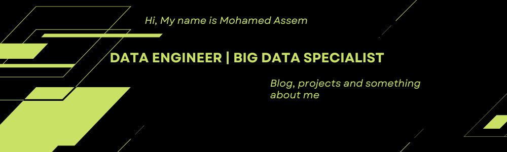

<!-- More info, tips and tricks for making GitHub Profile README can be found in this article: https://towardsdatascience.com/build-a-stunning-readme-for-your-github-profile-9b80434fe5d7 -->

# Hey there! 

- I’m an aspiring Data Engineer with a solid background in Computer Science and a strong interest in turning raw data into meaningful insights. I enjoy building data pipelines and working with tools like Python, SQL, Apache Spark, and Kafka to create real-time and batch processing solutions.

- I also have experience with Docker for containerization, making it easier to design and deploy scalable data systems. My focus is on writing clean, efficient code and applying best practices in data engineering to ensure data reliability and accuracy. 
## Contact
- 
- 

## Technologies & Tools
  <!-- ======================= Big Data & Distributed Systems ======================= -->
  ### Big Data & Distributed Systems
  
  
  
  
  
  
  <!-- ======================= Cloud Data Warehousing ======================= -->
  ### Cloud Data Warehousing
  
  
  
  <!-- ======================= Workflow Orchestration ======================= -->
  ### Workflow Orchestration
  
  
  <!-- ======================= Databases ======================= -->
  ### Databases
  
  
  
  
  
  <!-- ======================= Programming & Query Languages ======================= -->
  ### Programming & Query Languages
  
  
  
  <!-- ======================= Tools & Environment ======================= -->
  ### Tools & Environment
  
  
  
  <!-- ======================= Version Control ======================= -->
  ### Version Control
  
  
  
  <!-- ======================= Visualization ======================= -->
  ### Visualization
  

## About Me
- 🎓 Strong foundation in **Computer Science**  
- ⚡ Experienced in building **real-time and batch data pipelines**  
- 🛠 Skilled with **Python, SQL, Spark, and Kafka**  
- 📦 Comfortable with **Docker** for containerized deployments  
- 🚀 Passionate about **data accuracy, scalability, and automation**  

<!-- links to social media icons -->

[2.2]: http://i.imgur.com/9I6NRUm.png (github icon without padding)
[3.2]: https://raw.githubusercontent.com/MartinHeinz/MartinHeinz/master/linkedin-3-16.png (LinkedIn icon without padding)

<!-- links to your social media accounts -->

[3]: https://www.linkedin.com/in/mohammed-asem/

<!-- Resources -->
<!-- Shields: https://shields.io/ -->
<!-- GitHub Stats: https://github.com/anuraghazra/github-readme-stats -->

<!-- Resources -->
<!-- Shields: https://shields.io/ -->
<!-- GitHub Stats: https://github.com/anuraghazra/github-readme-stats -->
